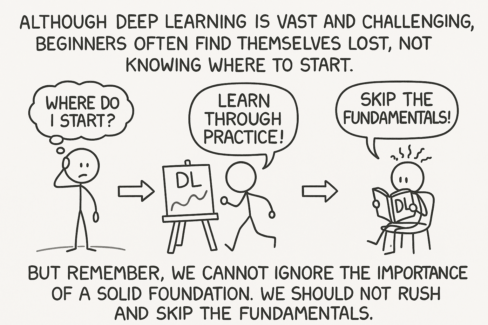

# VPSG Research Projects: Computer Vision Papers, Code, and Resources  


<small>*(The image was generated by ChatGPT.)*</small>

Welcome to the VPSG (Visual Perception and Security Group) research repository. This space is dedicated to organizing and collecting high-level papers, GitHub code links, and other valuable resources for different research domains within VPSG. Each research team is encouraged to upload their relevant work within their field and cross-domain papers that can inspire innovation. 

In this repository, you will find contributions from various teams working on Deepfake Detection, Medical Image Segmentation, Anomaly Detection, and more. If you want to contribute to this collection, feel free to send a pull request or contact me directly. The aim of this repository is to compile only high-quality research and resources in these fields, helping researchers to find the best practices and enhance their work.

## Contents

- [Git Collaborative Development Guide](#git-collaborative-development-guide)

- [Learning Resources](#learning-resources)

- [CCF Recommended Journals and Conferences](#ccf-recommended-journals-and-conferences)

- [Recommended Personal Websites](#recommended-personal-webset)

- [Deepfake Detection](#deepfake-detection)

- [Useful Diagramming Tools](#useful-diagramming-tools)


## Git Collaborative Development Guide


<br>


Note: Network Issues When Using Git Clone
I’ve noticed an issue when using git clone on campus networks: both HTTP and SSH fail to work in certain cases. However, when switching to a personal hotspot, SSH works, but HTTP still doesn't.

### How to Configure SSH for GitHub and Clone a Repository

#### 1. Generate SSH Key
Open your terminal or Git Bash (for Windows) and run the following command to generate a new SSH key:

```bash
ssh-keygen -t rsa -b 4096 -C "your_email@example.com"
```
Replace "your_email@example.com" with the email address you registered on GitHub.

Follow the prompts:

- **File to save the key**: Press Enter to use the default location (~/.ssh/id_rsa), or specify a custom path.

- **Password protection**: You can choose to set a password for the key or press Enter to skip it.

#### 2. Start SSH Agent and Add the Key
After generating the key, you need to start the SSH agent and add your private key to the agent. Run the following commands:

```bash
eval "$(ssh-agent -s)"
ssh-add ~/.ssh/id_rsa
```
#### 3. Add SSH Public Key to GitHub
To add your SSH public key to GitHub, follow these steps:

1. Copy your public key:

```bash
cat ~/.ssh/id_rsa.pub
```
2. Log in to your GitHub account.

3. Click on your profile picture in the top-right corner and select Settings.

4. In the left sidebar, choose SSH and GPG keys.

5. Click New SSH key, add a title (e.g., "My Laptop"), and paste the public key in the Key section.

6. Click Add SSH key to save.

#### 4. Test SSH Connection
To test whether SSH is correctly configured, run the following command:
```bash
ssh -T git@github.com
```
If everything is set up correctly, you should see a welcome message like this:
```bash
Hi username! You've successfully authenticated, but GitHub does not provide shell access.
```


### The Importance of Git Collaboration in Research and Professional Work
Git is a powerful version control system widely used in collaborative development environments. It is especially crucial in research settings, where teams work together on complex projects and need to track changes, collaborate seamlessly, and maintain a history of their work. In academic and professional research, the use of Git ensures that data, code, and documentation are shared efficiently, and collaboration between different team members remains smooth and organized.

In research projects, Git is essential for managing large datasets, conducting experiments, and developing software tools. It allows multiple researchers to work on the same codebase without overwriting each other’s work, enables efficient code review processes, and helps in reproducing experiments and validating results. Furthermore, it offers the possibility of continuous integration and automated testing, which is invaluable for ensuring the quality and reliability of research outputs.

Beyond research, Git continues to play a vital role in professional work, especially in the technology sector. Being proficient in Git is a fundamental skill for software developers, data scientists, and other professionals who work on team-based projects. As the technology landscape evolves, Git remains central to the development of applications, websites, and other digital solutions. Familiarity with Git is therefore a necessary competency for both researchers and professionals to maintain a competitive edge and keep up with the rapidly advancing fields of technology and science.
### Reflection on Git Proficiency Among Laboratory Members
Despite its importance, it is still observed that some members of the laboratory may not be fully proficient in using Git. This gap in skillsets can lead to challenges such as inefficient collaboration, potential errors in version control, or difficulties in managing and merging different code versions. It is crucial for the lab members to reflect on the importance of Git in their daily workflows and research activities.

As Git is fundamental to modern collaborative work, especially in scientific research, there should be an emphasis on training and educating all team members in its usage. Teams should encourage a culture of learning and continuous improvement, ensuring that everyone is comfortable with Git and can use it effectively. This will not only enhance the efficiency of collaborative work but also ensure that research outputs are reliable, reproducible, and scalable.

To improve Git proficiency, I will write a brief tutorial, and for other issues that arise, team members are encouraged to consult available resources and troubleshoot independently. By providing this foundational guide, the lab can enhance overall productivity, collaboration, and the quality of research projects.

### Contributing to the Project: A Guide for Non-Collaborators and Collaborators

Below, I will provide a tutorial from two perspectives: non-collaborators and collaborators, covering how to pull and push changes. Since this project is open-source, we will not grant collaborator access to non-laboratory members. However, if you want to contribute or have valuable suggestions and ideas, you are encouraged to follow the tutorial below. We will gladly consider and appreciate any good contributions.

### Non-Collaborators


#### 1. Fork the Repository
First, click the "Fork" button at the top right corner of the repository page to fork the repository to your own GitHub account.

#### 2. Clone Your Forked Repository
Once the repository is forked, clone it to your local machine:

```bash
git clone https://github.com/yourusername/your-forked-repository.git
cd your-forked-repository
```

#### 3. Create a New Branch
Create a new branch for the changes or suggestions you want to make:
```bash
git checkout -b your-branch-name
```

#### 4. Make Changes
Edit the files or add new content based on the suggestions or improvements you want to make. This could be code changes, documentation updates, or new features.

#### 5. Commit the Changes
Once you've made your changes, commit them:
```bash
git add .
git commit -m "Describe the changes you made"
```

#### 6. Push the Changes

Push the changes to your forked repository:
```bash
git push origin your-branch-name
```
#### 7. Create a Pull Request
Go to your forked repository on GitHub and click "Compare & Pull Request." Write a clear description of what changes you made, then submit the pull request. We will review your contribution and, if suitable, merge it into the main repository.

#### 8. Alternative: Open an Issue
If you cannot make code changes but have a suggestion or idea, you can create an issue in the "Issues" tab of the repository. Describe your idea in detail, and we will review and consider it.

### Collaborators
As a collaborator, you can directly clone the repository, create a branch, make changes, and push them to the remote repository, followed by creating a pull request for review and merging.

## Learning Resources

<br>

Although deep learning is vast and challenging, beginners often find themselves lost, not knowing where to start. Starting from scratch can take a lot of time, so the best solution is to learn through practice. However, we cannot ignore the importance of a solid foundation. We should not rush and skip the fundamentals.

### Recommended Book:
- **Dive into Deep Learning** by Li Mu  
  [GitHub Link](https://github.com/d2l-ai/d2l-zh)

## Recommended Video Courses on Deep Learning:

- **Stanford 2021 Fall: Practical Machine Learning (Chinese)**:
  - [Watch the course](https://space.bilibili.com/1567748478/channel/collectiondetail?sid=28144)
  
- **Dive into Deep Learning - PyTorch Version**:
  - [Watch the course](https://space.bilibili.com/1567748478/channel/seriesdetail?sid=358497)

- **Li Mu’s Research Paper Reading Videos**:
  - [Watch Li Mu's research papers video](https://space.bilibili.com/1567748478/channel/collectiondetail?sid=32744)

- **Tutorials and Blogs**:
  - [Medium - Towards Data Science](https://towardsdatascience.com/)
  - [Kaggle Learn](https://www.kaggle.com/learn)
  - [PyImageSearch - Practical Computer Vision](https://pyimagesearch.com/)


These high-quality resources will help you understand the core concepts of deep learning and enable you to gain practical skills more quickly. Remember, a solid foundation is key to progressing in deep learning effectively.


## CCF Recommended Journals and Conferences
### Preface: The Importance of Reading Top Journals and Conferences<br>


<br>


In academic research, choosing to read high-quality journals and conference papers is crucial to improving one’s academic level and research ability. Particularly when you dive deeper into a specific field, reading papers from top-tier journals and conferences will help you understand the latest developments and prevent you from wasting time on lower-quality publications. Leading journals and conferences are often at the forefront of innovation, and the papers they publish typically represent the latest advancements and best practices in the field. Therefore, reading these papers not only helps you understand key issues in the field but also assists in finding innovative points for your own research.

Below are some recommended high-quality journals and conferences, sorted according to CCF (China Computer Federation) rankings, for your reference:

- CCF Recommended List: [CCF Official Site](https://www.ccf.org.cn/Academic_Evaluation/By_category/)
- Journal Database: [LetPub Journal Database](http://www.letpub.com.cn/index.php?page=journalapp)
- Huiban CCF Query: [Huiban CCF Query](http://www.myhuiban.com/)
- CCF Conference Deadlines: [CCF Conference Deadlines](https://ccfddl.github.io/)

### Tier 1: Top Journals and Conferences (Including all CCF-A journals and conferences, IEEE/ACM Trans)

#### Recommended Journals:
- **IEEE Transactions on Pattern Analysis and Machine Intelligence** (Tier 1, CCF-A)
- **IEEE Transactions on Image Processing** (Tier 1, CCF-A)
- **IEEE Transactions on Information Forensics and Security** (Tier 1, CCF-A)
- **IEEE Transactions on Multimedia** (Tier 1, CCF-B)
- **IEEE Transactions on Circuits and Systems for Video Technology** (Tier 1, CCF-B)

#### Recommended Conferences:
- **IEEE Conference on Computer Vision and Pattern Recognition** (CVPR)
- **International Conference on Computer Vision** (ICCV)
- **Conference on Neural Information Processing Systems** (NeurIPS)
- **International Conference on Machine Learning** (ICML)
- **AAAI Conference on Artificial Intelligence** (AAAI)
- **ACM Multimedia** (MM)
- **International Joint Conference on Artificial Intelligence** (IJCAI)

### Tier 2: Authoritative Journals and Conferences (Including ordinary Chinese Academy of Sciences Tier 1 journals, CCF-B journals or conferences)

#### Recommended Journals:
- **Information Science** (Tier 1, CCF-B)
- **Pattern Recognition** (Tier 1, CCF-B)
- **Information Fusion** (Tier 1)
- **Expert Systems with Applications** (Tier 1, CCF-C)
- **Knowledge-Based Systems** (Tier 1, CCF-C)
- **Applied Soft Computing** (Tier 1)
- **IEEE Internet of Things Journal** (Tier 1)
- **Computer Vision and Image Understanding** (CCF-B)
- **Signal Processing** (Tier 2, CCF-C)

#### Recommended Conferences:
- **International Conference on Multimedia and Expo** (ICME)
- **International Conference on Acoustics, Speech and Signal Processing** (ICASSP)
- **ACM International Conference on Information and Knowledge Management** (CIKM)
- **International Conference on Multimedia Retrieval** (ICMR)

## Recommended Personal Websites:

- [Xie Enze's Personal Website](https://xieenze.github.io/)
- [WHAI 362's Personal Website](https://whai362.github.io/)
- [Ye Hanjie’s Personal Website](http://www.lamda.nju.edu.cn/yehj/)
- [Wu Peng's Personal Website](https://teacher.nwpu.edu.cn/wupeng.html)
- [ImPlus Personal Website](http://implus.github.io/)
- [Gao Huang's Personal Website](http://www.gaohuang.net/)
- [DAMO CV Organization Repositories](https://github.com/orgs/damo-cv/repositories)
- [Jian Zhang's Villa Tech Website](https://villa.jianzhang.tech/pub/)

## Deepfake Detection
### 1. **Within the Deepfake Detection Field**

#### **Recommended Journals:**
- **IEEE Transactions on Pattern Analysis and Machine Intelligence (CCF-A)**:
  - *Paper Title*: xxx <br> 
    *Year*: 2025  
    [GitHub Link](https://github.com/xxx)
  - *Paper Title*: xxx <br>
    *Year*: 2025 
    [GitHub Link](https://github.com/xxx)

- **IEEE Transactions on Image Processing (CCF-A)**:
  - *Paper Title*: xxx <br>
    *Year*: 2025  
    [GitHub Link](https://github.com/xxx)

#### **Recommended Conferences:**
- **IEEE Conference on Computer Vision and Pattern Recognition (CVPR)**:
  - *Paper Title*: xxx <br>
    *Year*: 2025 <br> 
    [GitHub Link](https://github.com/xxx)

- **International Conference on Computer Vision (ICCV)**:
  - *Paper Title*: xxx <br>
    *Year*: 2025  
    [GitHub Link](https://github.com/xxx)

---

### 2. **Related Fields Providing Innovation Points**

#### **Recommended Journals:**
- **Pattern Recognition (CCF-B)**:
  - *Paper Title*: xxx <br>
    *Year*: 2025  
    [GitHub Link](https://github.com/xxx)


#### **Recommended Conferences:**
- **International Conference on Machine Learning (ICML)**:
  - *Paper Title*: xxx  
    *Year*: 2025  
    [GitHub Link](https://github.com/xxx)

### 3. **Awesome GitHub Repositories**

Here are some fantastic GitHub repositories dedicated to Deepfake Detection and Generation:

- [**Awesome Deepfakes Detection**](https://github.com/Daisy-Zhang/Awesome-Deepfakes-Detection): A collection of resources on deepfake detection, including papers, tools, and datasets.
- [**Awesome Deepfake Generation and Detection**](https://github.com/flyingby/Awesome-Deepfake-Generation-and-Detection): A curated list of resources focusing on both deepfake generation and detection.

## Useful Diagramming Tools

- [NN-SVG](https://alexlenail.me/NN-SVG/): A tool that helps generate neural network architecture diagrams.
- [PlotNeuralNet](https://github.com/HarisIqbal88/PlotNeuralNet): An open-source project for visualizing neural network architectures.
- [Netron](https://github.com/lutzroeder/netron): A tool for visualizing deep learning models.
- [Zetane Viewer](https://github.com/zetane/viewer): A tool for displaying and interacting with deep learning models.
- [ProcessOn](https://www.processon.com/): An online diagramming tool that supports flowcharts, mind maps, etc.
- [PyTorchViz](https://github.com/szagoruyko/pytorchviz): A tool for visualizing PyTorch models.
